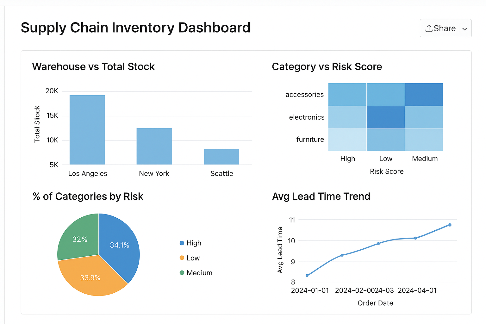

```markdown
# 🧱 End-to-End Data Engineering Project — Supply Chain Inventory (AI-Enhanced)

## 🎯 Project Objective  
Build a **scalable, AI-powered supply chain inventory analytics pipeline** using Databricks.  
The pipeline ingests raw inventory data (from Kaggle), processes and transforms it through structured **Bronze → Silver → Gold** layers, and generates **actionable insights and dashboards** for inventory management and risk optimization.

---

## ⚙️ Tech Stack  

| Layer | Tools & Services |
|-------|------------------|
| **Data Ingestion** | Databricks File Upload *(simulating ADF ingestion)* |
| **Storage** | Databricks FileStore *(Delta Lake)* |
| **Processing & Transformation** | Databricks (PySpark, SQL) |
| **Data Layers** | Bronze → Silver → Gold |
| **Visualization** | Databricks Dashboard |
| **Languages** | PySpark, SQL, Python, Markdown |
| **Version Control** | Git & GitHub |

---

## 🪜 Step-by-Step Implementation  

### **Step 1: Create Workspace & Upload Data**  
1. Open your **Databricks Workspace**.  
2. Navigate to **Data → Add Data → Upload File**.  
3. Upload your Kaggle dataset (e.g. `Inventory Management E-Grocery - InventoryData.csv`).  
4. Once uploaded, Databricks will show a file path similar to:  
```

/FileStore/tables/supply_chain_inventory.csv

````

---

### **Step 2: Bronze Layer — Raw Ingestion**  
**Notebook:** `01_Bronze_Ingestion`  
**Goal:** Store the raw dataset exactly as ingested, without any cleaning or transformation.  

**Actions:**  
- Read CSV into PySpark DataFrame.  
- Write data as **Delta Table** in the Bronze zone.  

---

### **Step 3: Silver Layer — Data Cleaning & Transformation**  
**Notebook:** `02_Silver_Transformation`  
**Goal:** Clean nulls, correct data types, remove duplicates, and standardize columns for analysis.  

**Actions:**  
- Apply schema corrections.  
- Remove invalid or missing records.  
- Format date, numeric, and categorical columns.  
- Store the clean dataset as a **Silver Delta Table**.

---

### **Step 4: Gold Layer — Business Aggregations & AI KPIs**  
**Notebook:** `03_Gold_Modeling`  
**Goal:** Create business-ready tables and AI-driven KPIs.  

**Actions:**  
- Aggregate metrics (total stock, turnover rate, lead time).  
- Create AI-enhanced KPIs like risk score, forecasted demand, etc.  
- Output results as **gold_inventory_kpi** Delta Table.  

---

### **Step 5: Visualization — Databricks Dashboard**  
Use **Databricks SQL Editor** to create visuals from the Gold Layer table.  

Query:
```sql
SELECT * FROM supply_chain_db.gold_inventory_kpi;
````

**Recommended Visuals:**

* 📊 **Bar Chart:** Warehouse vs Total Stock
* 🔥 **Heatmap:** Category vs Risk Score
* 🥧 **Pie Chart:** % of Categories by Risk Level
* 📈 **Line Chart:** Avg Lead Time Trend

Combine these visuals into a single **Databricks Dashboard** and publish it.

**Dashboard Preview:**


---

### **Step 6: AI Enhancement Ideas**

* 🧠 Add forecasting for **Next Month’s Inventory Demand** using Databricks **AutoML**.
* 🤖 Use **Databricks Genie AI Assistant** to generate SQL queries or insights.
* 📈 Integrate **MLflow** for experiment tracking and model versioning.

---

### **Step 7: Version Control with GitHub**

1. In Databricks → **Repos → Add Repo → Connect to GitHub**.
2. Commit each notebook (`01_Bronze_Ingestion`, `02_Silver_Transformation`, `03_Gold_Modeling`).
3. Push updates to your GitHub repository.

---

## 📊 Project Architecture (Simplified)

```
Kaggle CSV
   ↓ (upload)
Databricks FileStore
   ↓
Bronze Layer (Raw)
   ↓
Silver Layer (Cleaned)
   ↓
Gold Layer (Aggregated + AI)
   ↓
Databricks Dashboard
```

---

## 📈 KPI Summary (Sample)

| KPI                       | Description                                 | Example Value |
| ------------------------- | ------------------------------------------- | ------------- |
| **Total Stock**           | Total available units across all warehouses | 2,340,000     |
| **Avg Lead Time**         | Average time from order to fulfillment      | 5.4 days      |
| **High-Risk Inventory %** | Portion of SKUs at risk of shortage         | 18%           |
| **Warehouse Count**       | Total number of active warehouses           | 3             |

---

## 🧩 Future Enhancements

* Integrate with **Azure Data Factory** for automated ingestion.
* Add **Power BI or Tableau** as external visualization layer.
* Deploy **predictive inventory optimization models** using **Databricks MLflow**.

---

**👩‍💻 Author:** [Ananya Shivhare](https://github.com/ananyashivhare)
**📅 Created:** November 2025
**🧠 Focus:** Data Engineering, AI, and Analytics in Supply Chain Optimization

```
